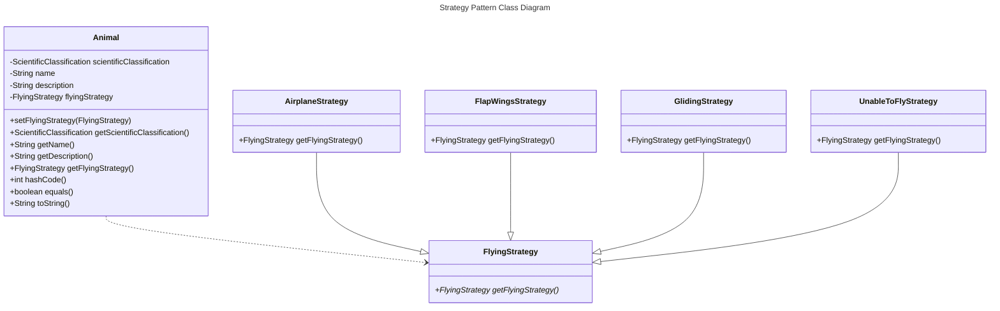

```mermaid
---
title: Strategy Pattern Class Diagram
---
classDiagram
    Animal ..> FlyingStrategy
    AirplaneStrategy --|>  FlyingStrategy
    FlapWingsStrategy --|> FlyingStrategy
    GlidingStrategy --|> FlyingStrategy
    UnableToFlyStrategy --|> FlyingStrategy
    class FlyingStrategy {
        +FlyingStrategy getFlyingStrategy()*
    }
    class AirplaneStrategy {
        +FlyingStrategy getFlyingStrategy()
    }
    class FlapWingsStrategy {
        +FlyingStrategy getFlyingStrategy()
    }
    class GlidingStrategy {
        +FlyingStrategy getFlyingStrategy()
    }
    class UnableToFlyStrategy {
        +FlyingStrategy getFlyingStrategy()
    }
    class Animal {
        -ScientificClassification scientificClassification
        -String name
        -String description
        -FlyingStrategy flyingStrategy
        +setFlyingStrategy(FlyingStrategy)
        +ScientificClassification getScientificClassification()
        +String getName()
        +String getDescription()
        +FlyingStrategy getFlyingStrategy()
        +int hashCode()
        +boolean equals()
        +String toString()
    }

```