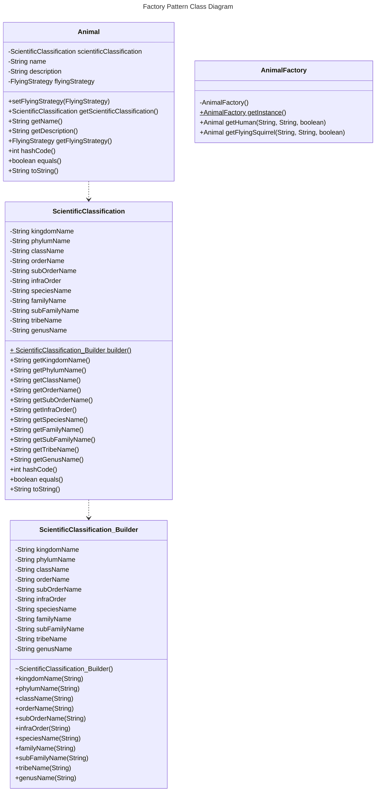

```mermaid
---
title: Factory Pattern Class Diagram
---
classDiagram
    Animal ..> ScientificClassification
    ScientificClassification ..> ScientificClassification_Builder
    class AnimalFactory {
        -AnimalFactory()
        +AnimalFactory getInstance()$
        +Animal getHuman(String, String, boolean)
        +Animal getFlyingSquirrel(String, String, boolean)
    }
    class ScientificClassification {
        -String kingdomName
        -String phylumName
        -String className
        -String orderName
        -String subOrderName
        -String infraOrder
        -String speciesName
        -String familyName
        -String subFamilyName
        -String tribeName
        -String genusName
        + ScientificClassification_Builder builder()$
        +String getKingdomName()
        +String getPhylumName()
        +String getClassName()
        +String getOrderName()
        +String getSubOrderName()
        +String getInfraOrder()
        +String getSpeciesName()
        +String getFamilyName()
        +String getSubFamilyName()
        +String getTribeName()
        +String getGenusName()
        +int hashCode()
        +boolean equals()
        +String toString()
    }
    class ScientificClassification_Builder {
        -String kingdomName
        -String phylumName
        -String className
        -String orderName
        -String subOrderName
        -String infraOrder
        -String speciesName
        -String familyName
        -String subFamilyName
        -String tribeName
        -String genusName
        ~ScientificClassification_Builder()
        +kingdomName(String)
        +phylumName(String)
        +className(String)
        +orderName(String)
        +subOrderName(String)
        +infraOrder(String)
        +speciesName(String)
        +familyName(String)
        +subFamilyName(String)
        +tribeName(String)
        +genusName(String)
    }
    class Animal{
        -ScientificClassification scientificClassification
        -String name
        -String description
        -FlyingStrategy flyingStrategy
        +setFlyingStrategy(FlyingStrategy)
        +ScientificClassification getScientificClassification()
        +String getName()
        +String getDescription()
        +FlyingStrategy getFlyingStrategy()
        +int hashCode()
        +boolean equals()
        +String toString()
    }

```