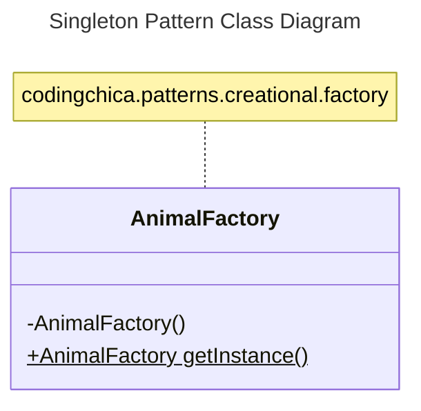

# Singleton Pattern

The singleton pattern is useful when you want to ensure that at most one instance of an object is ever created.

Rather than using the constructor, a static method is used to retrieve an instance.  On the initial call, this method 
also creates the reused instance.

This might be useful in software development if the creation / storage of the object is expensive, or if multiple 
instances of the object are simply unnecessary, as no instance data/fields are utilized - thereby reducing memory usage 
and garbage collection.

